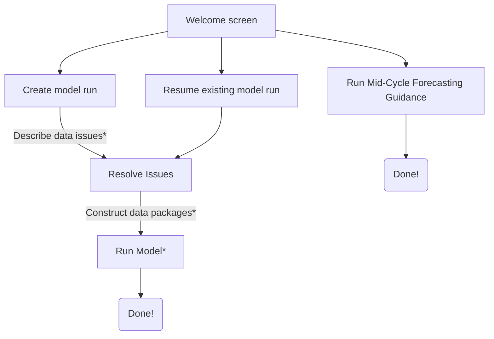

## The source code for the PAMF Model  

The top-level files (app.R and interface-functions.R) control how the interface looks and how the
user moves through it. To keep them readable, the server code behind each screen is sourced from an
R script from the relevant subdirectory. Each directory listed below corresponds to one screen of the 
user interface.

The user experience flows as follows:

*These pieces do not have a corresponding screen on the UI  

## DIRECTORIES  

- :file_folder: [comparison-tools](/src/comparison-tools/)  
Functions that find differences between different versions of model outputs  

- :file_folder: [construct-datpaks](/src/construct-datpaks/)   
Script (and its supporting functions) to build data packages from 
management/monitoring reports, and determine which data packages can be used for
which parts of the model.  

- :file_folder: [cost-estimates](/src/cost-estimates/)   
Estimates management costs from reports that provide sufficient information.  

- :file_folder: [create-new-run](/src/create-new-run/)   
Takes input from the user about the run they'd like to create. If there are no 
input mistakes, creates a new sub-directory of [pamf-model/model-runs/](/model-runs/) containing
a log of user inputs, and cumulative tables containing all known issues with the 
management and monitoring reports making up the entire history of this model run.   

- :file_folder: [forecast-guidance](/src/forecast-guidance/)   
Contains scripts that read necessary information for guidance forecasts, do QAQC 
checks on user input, and generate guidance forecasts.

- :file_folder: [resume-active-run](/src/resume-active-run/)   
Takes input from the user about which active run they'd like to work with. 
Re-loads the data from the desired run. Only runs that do not yet have a guidance
output are considered active.  

- :file_folder: [review-reports](/src/review-reports/)   
Shows the user a list of possible issues with all management/monitoring reports 
that were added since the previous run, and allows the user to enter decisions 
about whether to withhold each report from different parts of the model.  

- :file_folder: [run-model](/src/run-model/)   
Code that updates the transition matrices and the partial controllability matrix, 
calculates management costs, runs the optimization, assigns guidance to management 
units.  

## FILES  

- [fast-file-read.R](/src/fast-file-read.R)   
Reads and formats a set of inputs. Used for development purposes only.  

- [format-functions.R](/src/format-functions.R)   
Functions that format the database tables selected by the user.  

- [general-fuctions.R](/src/general-fuctions.R)      
Functions that are used by code in more than one of the directories (e.g., data formatting).  

- [global-constants.R](/src/global-constants.R)   
File defining programmatic constants (e.g., stem density threshold, phase 
durations, management actions).  

- [interface-functions.R](/src/interface-functions.R)  
Functions that generate each user interface screen.   

- [policy-definitions2018-07-31.csv](/src/policy-definitions2018-07-31.csv)  
This file defines all possible combinations of management restrictions that may 
affect a MU, as well as the PAMF combinations that are available under each 
restriction set.  
Used by: [src/run-model/run-the-model.R](src/run-model/run-the-model.R)  
Generated by: [src/run-model/generators/generate-policy-definitions.R](src/run-model/generators/generate-policy-definitions.R)  

- [review-input-functions.R](/src/review-input-functions.R)   
Functions supporting [review-user-inputs.R](/src/create-new-run/review-user-inputs.R) and the analogous script for the Mid-Cycle inputs.   
