# Model Schematic

The PAMF model is comprised of many R and Rmd files. It can be started by opening **app.R** in the main folder of the repository. The schematic below shows the order of operations for the model starting from running the **app.R** file as an R Shiny app. **app.R** sources all the files connected by the solid lines in the [model schematic](#model-schematic) below in order from top to bottom. Any scripts connected by dotted lines indicate scripts run by a different parent script, in order from top to bottom. See the key for more information about colors and lines used in the schematic. [Standalone files](#standalone-files) are not called by **app.R** and can be run as needed by the user. 

Each folder in this repository contains README.md files describing the contents of the folder.    

The PAMF Model git repository also contains a number of CSV files necessary for running and/or testing the model. Metadata for these files can be found in [Table_metadata.csv](user-guide/Table_metadata.csv), with additional metadata found in the [PAMF data release](https://doi.org/10.5066/P92NZCYL). Descriptions of the columns in "Table_metadata.csv" are found in the [user-guide folder's README file](user-guide/README.md). Note that some of the CSV files in this repository can also be found in the PAMF data release, and are retained in this git repository as convenience copies.  

For more information about how to run the PAMF Model, see the [PAMF Model User Guide](user-guide.md).  

## Model Schematic  
This schematic includes all the scripts and files sourced when running the PAMF Model. 

```mermaid

flowchart LR
subgraph runapp[Running the PAMF Model]
    FF[Run Shiny App]:::useraction --> A(app.R)
    A --- C(global-constants.R)
    C --- D(interface-functions.R)
    D -.- II(checkbox-modules.R)
    D --- E(general-functions.R)
    E --- F(format-functions.R)
    F --- G(review-input-functions.R)
    G --- BB[Shiny Main Dashboard]:::decision
    BB --> H[Create New Run]:::decision
    H --- I(create-run-functions.R)
    I --- J(review-user-inputs.R)
    J --- CC(find-monitor-issues.R)
    CC --- DD(find-manage-issues.R)
    DD --- K(checkbox-functions.R)
    K --- L(generate-issues-report.R)
    L -.Issues to review .- JJ(report.Rmd)
    JJ -.- KK(word-styles-reference.docx)
    JJ -..- LL(Reports_To_Review.docx):::product
    LL -.-> MM[Manually review reports]:::useraction
    MM -.-> JJJ[Restart Shiny app]:::useraction
    JJJ -.-> KKK[Shiny Main Dashboard]:::decision
    L -- No issues to review--- U[Resolve reports]:::decision
    BB --> B[Reload Run]:::decision
    B --- M(reload-run.R)
    M --> U
    N --- O(find-unsaved-selections.R)
    BB --> P[Get midcycle forecast]:::decision
    P --- Q(midcycle-functions.R)
    Q --- R(review-midcycle-inputs.R)
    R --- S(find-midcycle-issues.R)
    S --- T(forecast-guidance.R)
    T -.- NN(optimizer-functions.R) 
    T---- GG[Midcycle Forecast Complete!]:::product
    U --- V(display-flagged-reports.R)
    V -.- OO(checkbox-functions.R)
    V ---> N[Finalize run]:::decision
    O --- EE[Run the model]:::decision
    EE --- W(construct-datpaks.R)
    W -------- X(datamod_2018.R)
    W -.-RR(datpak-functions.R)
    RR -.- SS(phase-date-agreement.R)
    SS -.- PP(assemble-datpaks.R)
    PP -.- QQ(find-datpak-issues.R)
    QQ -.- TT(file-io-special-cases.R)
    X --- Y(datamod_2019.R)
    Y --- Z(run-the-model.R)
    Z -.- UU(file-io-special-cases.R)
    UU -.- VV(update-transitions.R)
    VV -.-ZZ(transition-update-functions.R)
    VV -..- WW(cost-calculation-functions.R)
    WW -.- XX(cost-helper-functions.R)
    XX -.- YY(calculate-costs.R)
    YY -.- AAA(build-reward-matrix.R)
    AAA -.-BBB(pc-update-functions.R)
    BBB -.- CCC(update-pc.R)
    CCC -.- DDD(optimizer-functions.R)
    DDD -.- EEE(suboptimal-functions.R)
    EEE -.- FFF(optimizer.R)
    FFF -.- GGG(policy2guidance.R)
    Z ---------------- AA[Model run complete!]:::product
    KKK -.-> B
    classDef decision fill:#5BB6C4,stroke:#000000,color:#fff;
    classDef product fill:#FDB940,stroke:#000000;
    classDef useraction fill:#B97E46,stroke:#000000,color:#fff;
end
subgraph sgclass[Standalone scripts]
   direction TB
    HH(fast-file-read.R)
    HHH(rename-files.R)
    III(rename-files-midcycle.R)
end
subgraph keyclass[Key to colors and lines]
    direction TB
    LLL(R or Rmd scripts)
    MMM(Shiny interface<br>or choice):::decision
    NNN(End product<br>or process):::product
    OOO(Manual action<br>by user):::useraction
    subgraph Lines1[Sourced by app.R]
    direction LR
    PPP(A) --- QQQ(B)
    end
    subgraph Lines2[Sourced by parent script in line]
    RRR(A) -.- SSS(B)
    end
    subgraph Lines3[Sourced by script directly above]
    TTT(A) -.- UUU(B)
    end
end

linkStyle 16 stroke-width:2px,fill:none,stroke:lightgray;
linkStyle 43 stroke-width:2px,fill:none,stroke:lightgray;
linkStyle 48 stroke-width:2px,fill:none,stroke:lightgray;
linkStyle 63 stroke-width:2px,fill:none,stroke:lightgray;
style runapp fill:#FFFFFF,stroke:#FFFFFF,stroke-width:2px
style sgclass fill:#EAEAEA,stroke:#4B4B4B,stroke-width:2px
style keyclass fill:#FFFFFF,stroke:#4B4B4B,stroke-width:2px
style Lines1 fill:#FFFFFF,stroke:#FFFFFF,stroke-width:2px
style Lines2 fill:#FFFFFF,stroke:#FFFFFF,stroke-width:2px
style Lines3 fill:#FFFFFF,stroke:#FFFFFF,stroke-width:2px
```

## Standalone files  
These files are not sourced by **app.R** and are intended for standalone use. Note that these files may require the use of additional R libraries not specified on the main README of the repository -- see each file for the required packages. The README files in each folder containing the files describe the purpose of each script.     

- cost-constants/update-constants/update-cost-constants.R   
- src/fast-file-read.R       
- src/comparison-tools/model-run-comparisons.R  
- src/comparison-tools/comparison-functions.R   
- src/cost-estimates/test-cases/tests-for-cost-calc-functions.R  
- src/run-model/generators/interpolate-satisfaction.R                   
- src/run-model/generators/make-pc-matrix.R                                       
- src/run-model/generators/repair-priors.R  
- src/run-model/generators/generate-policy-definitions.R     
- src/run-model/generators/interpolate-transitions.R   
- src/run-model/generators/repair-functions.R  

