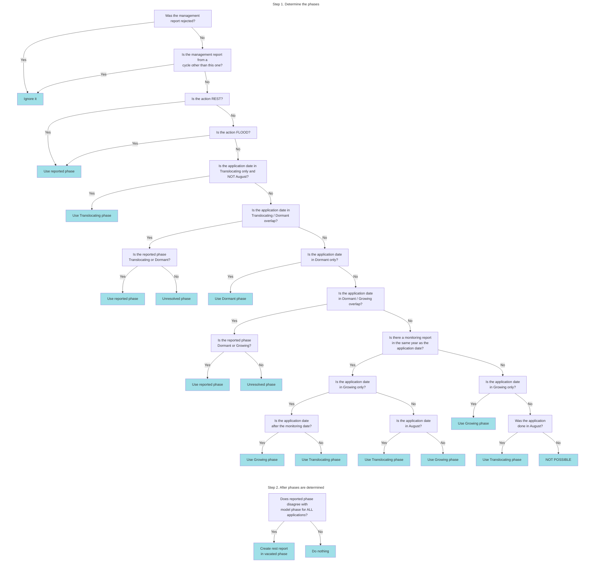

# Phase-Date Decisions

This chart shows the decisions made in the script [**phase-date-agreement.R**](/src/construct-datpaks/phase-date-agreement.R). These decisions determine which management phase a management report falls into based on the report's quality, reported date(s), management action, and other information.  

