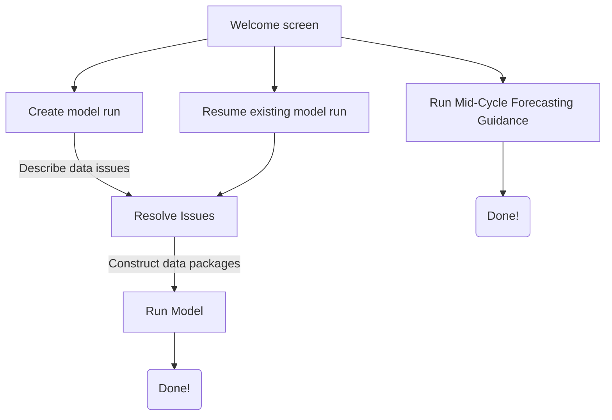

# PAMF Model User Guide  

## Table of Contents  
- [Introduction](#introduction)
- [Pre-requisites](#pre-requisites)
- [Adding Data](#adding-data)
- [Opening the PAMF Model Interface](#opening-the-pamf-model-interface)
- [Creating a New Model Run](#creating-a-new-model-run)   
- [Reviewing Possible Issues with Monitoring and Management Reports](#reviewing-possible-issues-with-monitoring-and-management-reports)
- [Entering decisions](#entering-decisions)  
- [How the Selections Work](#how-the-selections-work) 
- [Returning to an Incomplete Model Run](#returning-to-an-incomplete-model-run)
- [Model Outputs](#model-outputs) 
- [Create Mid-Cycle Forecasting Guidance](#create-mid-cycle-forecasting-guidance)
- [Mid-Cycle Forecasting Guidance Outputs](#mid-cycle-forecasting-guidance-outputs)
- [Dealing with base runs](#dealing-with-base-runs)
- [Reproducing past model runs](#reproducing-past-model-runs)  
- [Appendix](#appendix)  
  - [Appendix A. File Organization](#a-file-organization)  
  - [Appendix B. August Guidance Input Errors and Warnings](#b-august-guidance-input-errors-and-warnings)  
  - [Appendix C. Mid-Cycle Guidance Input Errors and Warnings](#c-mid-cycle-guidance-input-errors-and-warnings)  
  - [Appendix D. Test Cases](#d-test-cases)  
  
## Introduction

This user guide walks you through the process of running the PAMF Model and 
locating any inputs and outputs that you need. If you are interested in the R 
scripts that make up the PAMF Model and how they work together, visit the [PAMF Model Overview](model-overview.md). 
The PAMF model can be run in two key ways:  

1. To produce *Phragmites* management guidance for September-June of the upcoming 
year (run in August, and henceforth referred to as "August Guidance").  
2. To produce [Mid-Cycle Forecasting Guidance (MCFG)](#create-mid-cycle-forecasting-guidance) 
for September-June of the upcoming year but run in January to provide a prediction of August 
guidance using a more limited data set.  

## Pre-requisites  

- Installation of RStudio (https://www.rstudio.com/)   
- Installation of R (https://cran.r-project.org/)  
- PAMF Web Hub data and PAMF Model Data downloaded from USGS ScienceBase ([https://doi.org/10.5066/P92NZCYL](https://doi.org/10.5066/P92NZCY))   
- Clone of this Gitlab repository on your workstation   

## Adding Data  

A successful run of the PAMF model depends largely on file placement. For a run 
down of the folders present in this repository, see [Appendix A. File Organization](#a-file-organization).    

### Database downloads  

PAMF data are stored in a database on the PAMF Web Hub maintained by the Great 
Lakes Commission and the University of Georgia. To make use of these data in the 
model, PAMF staff pull the following tables from the database prior to the August 
and Mid-Cycle Forecasting model runs and remove any personally identifiable information (PII). 

**Table 1.** The type of data collected by PAMF participants, the model run for 
which those data are required, and the names of the .csv tables containing those 
data in both the PAMF Web Hub (only accessible by PAMF Staff) and the names of 
the .csv tables needed for use in the PAMF Model run (where "YYYY-MM-DD"" refers 
to the date of the Web Hub database pull).  

| Data type                           | Model Run     | Table name in PAMF Web Hub          | Table name needed for PAMF Model run |
|-------------------------------------|---------------|-------------------------------------|--------------------------------------|
| Monitoring reports                  | August        | TBL_fieldsheet.csv                  | monitor-YYYY-MM-DD.csv               |
| Enrollment reports                  | August & MCFG | tbl_managementunit.csv              | enroll-YYYY-MM-DD.csv                |
| Management reports                  | August & MCFG | TBL_treatmentreport.csv             | manage-YYYY-MM-DD.csv                |
| Management report application dates | August & MCFG | treatmentreportXapplicationdate.csv | managedate-YYYY-MM-DD.csv            |
| Mid-cycle reports                   | MCFG          | TBL_mid_guidance_req.csv            | midcycle-YYYY-MM-DD.csv              |

> :ear_of_rice: **For PAMF Staff reference only:**  
> Note that files from the PAMF Web Hub must be renamed and formatted properly 
for use in the PAMF Model run and PII removal. This can be automated using 
[rename-files.R]([/database-downloads/rename-files.R) for the August PAMF Model 
run or [rename-files-midcycle.R]([/database-downloads/rename-files-midcycle.R) 
for the Mid-Cycle Forecasting Guidance Model run. See Table 1 for the table names 
needed for the PAMF Model.    

For other users of the model, these data files are available in the correct format 
and with the correct naming conventions in the PAMF Data Releases found 
[here](https://doi.org/10.5066/P92NZCYL) (2017-2021 data) and 
[here](https://doi.org/10.5066/P9RKEY74) (2021 and later data). Note that only 
certain files are required for each type of model run (August vs. MCFG; Table 1).  
These data should be saved in **pamf-model/database-downloads**, in directories 
labeled by year (Figure 1). To replicate previous model runs using the data in 
the PAMF Data Release, download the "PAMF-Model-data.zip" file, navigate to the 
model run you wish to replicate (either in "midcycle-forecasts" or "model-runs" 
for August guidance), and move the folders inside the "database-downloads" folder 
to the "database-downloads" in the PAMF Model repository. 
[This script](./database-downloads/download-data-release.R) can automate 
this process, if desired.

**These naming conventions are mandatory**—the PAMF model uses them to determine 
whether each file contains the correct data, as well as to determine the last day 
that reports may have been submitted. 

To add data, create a new directory named with the current year, and save the 
original outputs of the database pull, along with the .csv files following the 
naming convention.

  

**Figure 1.** Example structure of the **pamf-model/database-downloads** 
directory. Each folder labeled by year should contain the .csv files listed above.  

### Previous model run data   

Previous model run data can be acquired from the PAMF data releases from 
[2018-2021](https://doi.org/10.5066/P92NZCYL) and 
[2021-most recent year](https://doi.org/10.5066/P9RKEY74).  
Previous August model run data are necessary for running the PAMF Model, 
as the Model builds upon results and learning from the previous cycle. 
The contents of the folder "model-runs" in the Data Release should be copied 
into [**pamf-model/model-runs/**](/model-runs/) in the git repository.  
Note that MCFG model run data ("midcycle-forecasts" in the Data Release) are not 
required for the model run, neither for August nor for subsequent MCFG runs.    

## Opening the PAMF Model Interface 

1. Inside of the **pamf-model** git directory, double-click on pamf-model.Rproj. 
This will open RStudio with **pamf-model** as the working directory.  
2. In RStudio, open [**app.R**](/src/app.R) in the [**pamf-model/src**](/src/) 
directory.  
3. Click the "Run App" button at the top right of the script window (Figure 2). 
A new window will pop up.  
4. You can run the interface in a web browser if you like by clicking the "Open 
In Browser" button in the pop-up window (Figure 3). It isn't necessary to switch 
to a browser, but the browser version has certain features (e.g., Ctrl-F) that 
the pop-up window does not.  

  

**Figure 2.** The location of 'Run App' button.  

  

**Figure 3.** Running the PAMF model in a browser.  

### Overview of the PAMF Model Interface User Experience  

## Creating a New Model Run  

These instructions tell you how to create a new model run that generates August 
guidance for the upcoming PAMF cycle. To create Mid-Cycle Forecasting Guidance, 
skip to the [Create Mid-Cycle Forecasting Guidance](#create-mid-cycle-forecasting-guidance) section.  

**IMPORTANT:** This assumes you have the previous model runs correctly placed in
your [**pamf-model/model-runs**](/model-runs/) folders. If you are running the 
PAMF Model for the first time and want to start fresh without any previous model
runs, and do not have any model runs in your [**pamf-model/model-runs**](/model-runs/) folder,
you MUST start your model runs at the year 2018 since this was the first year
the PAMF Model was run.  

1. Select "Create a new model run" on the welcome screen, then click "Go!"  
2. Fill out the fields on the next window:  
  1. Load files from the appropriate database pull
    - Choose files from the subdirectory of [**pamf-model/database-downloads**](/database-downloads/) 
    that is relevant to your new model run.
  1.  Select cost constants to use  
    - Cost constants define the prices of labor and supplies for different 
    management techniques. They are used in conjunction with participant data to 
    estimate the cost of each management action. Typically, you'll choose the 
    most recent set of constants. 
  1. Final year of the cycle you want to analyze  
    - This is the second year of the cycle that you want to run, e.g., for the 
    2019-2020 PAMF cycle, choose 2020. Typically, you'll choose the current calendar year.  
  1. Select the previous model run  
    - Choose the run whose transition matrices you want to use as a precursor to 
    the new model run. Typically, this is the run that produced the guidance that 
    was given to participants the previous August. These are the names of the 
    folders inside [**pamf-model/model-runs**](/model-runs/).   
  1. Add a label to the run directory (optional)  
    - The directory containing the new model run will be labeled with whatever you 
    type into this field. This label will help you distinguish between old runs 
    later on. The model will automatically append the date and time to your label 
    for the model run.  
3. Click "Review Reports!"  
4. If any errors are displayed, double-check your inputs, make any necessary 
changes, and try again.  
5. If any warnings are displayed, double-check your inputs. If you're satisfied 
that your inputs are correct, click "Review Reports!" a second time.  

Once your inputs are accepted, the program will create a new directory in 
[**pamf-model/model-runs**](/model-runs/) to hold the input and output of the 
new run. This directory is time-stamped to ensure uniqueness, and is labeled 
with any text you included in the optional labeling field. The cumulative 
output files are pre-populated from the previous model run that you selected. 
Additionally, the software generates a Word document detailing all issues with 
management and monitoring reports that may require your attention (see the next 
section for details). 

After creating the model run, you can close the software without losing your 
place—see the [Returning to an Incomplete Model Run](#returning-to-an-incomplete-model-run) 
section for instructions on re-opening an existing run.

Depending on your inputs when you create the model run, you may encounter 
one or more errors and/or warnings. Errors prevent the model run from moving to 
the next step without a change to one or more inputs. Warnings indicate possible 
input problems but leave the choice to you. To override warnings, click 
"Review Reports!" a second time.

Input problems will trigger the errors and/or warnings (see 
[Appendix B. August Guidance Input Errors and Warnings](#b-august-guidance-input-errors-and-warnings) for more details).  

## Reviewing Possible Issues with Monitoring and Management Reports

Collective learning in the PAMF model relies on sets of two monitoring reports 
and three or more management reports, together called a data package. Monitoring 
reports define a management unit's initial and final states within the current 
cycle, as well as the date threshold between the growing and translocating phases. 
Management reports describe what participants did to control *Phragmites* over 
the course of the cycle.

In order to contribute to learning, the data package must consist entirely of 
reports that describe well-executed monitoring or management actions. This 
distinction is not always clear cut enough for the software itself to detect. 
For example, participants can and do use the notes section of the report to 
describe obstacles preventing them from monitoring/managing as intended. In this 
and other cases that are subject to interpretation, the interface provides two choices:

- Allow the model run to use the report (default)  
- Withhold the report from the transition matrix updates, guidance, and/or AMUs.  

> :ear_of_rice: **For PAMF Staff reference only:**
> There is no option to change a report. The PAMF model software does not have 
access to the PAMF database, and creating a parallel version of the data would 
cause problems for reproducibility. The the user decides that a report does 
need to be changed, however, they can:
> 
> 1. Make the change on the Web Hub, or have the participant make the change.  
> 2. Conduct another database pull and create new data files.  

Issues that require human judgment are described both in the 'Review' window of 
the interface and 'Reports\_to\_Review.docx' in the model run directory. This document allows you to:

- Annotate your decisions with considerations and rationale
- Allocate decision making to multiple team members
- Work on decisions without leaving the model software running

> :memo: **Note:** You can close the software at any time by either clicking 
the red "x" in the upper right corner of the window, or by clicking the 
"Finalize Saved Selections" button at the bottom of the screen. If a stop 
sign appears in the bar above the RStudio console, click that as well. 
> 
> Management units with saved selections will not reappear the next time you 
open the software.  

## Entering decisions  

Once you're ready to enter decisions for each issue: 

1. Re-open the PAMF software if necessary (see [Returning to an Incomplete Model Run](#returning-to-an-incomplete-model-run))
2. Enter your name. If questions arise over old decisions, the coordinator 
will know whom to ask.
3. For each report displayed:
  1. Check the relevant boxes to withhold the report from different parts of 
  the model. Unchecked boxes allow the model to use the report.
  1. Add a short note explaining your decision (optional)
4. For each management unit displayed:
  1. When you've finished making selections/adding notes for a MU, click the Save button.
  1. You can undo selections by hitting the button a second time. The interface 
  will not clear, but your selections will be re-set in the issues file.
  1. You can undo and re-save selections within a session as many times as you need to.
5. You can close the software at any time by either clicking the red "x" in the 
upper right corner of the window, or by clicking the "Finalize Saved Selections" 
button at the bottom of the screen. If a stop sign appears in the bar above the 
RStudio console, click that as well. **Management units with saved selections will not reappear the next time you open the software.**
6. After you've saved your selections, click "Finalize Saved Selections and Run Model." 
Note that there is a rare problem where previous session closed during a 
save: the UI won't proceed but also doesn't show you the MU boxes.  

## How the Selections Work  

Checking each box beside a report withholds it from a different part of the 
model. The consequences of each selection are as follows:  

1. Exclude from transition matrix update  
   1. Selecting this box will prevent the report from appearing in the data package for the corresponding management unit. Whether the data package is then used to update either the transition or partial controllability matrices depends upon the type of report and the other reports in the package.  
    1. Monitoring reports: Check this box when the monitoring report defines a state that is unusable for the transition matrix update but may be usable for guidance. The corresponding data package will not be used to update the transition matrices.  
    1. Management reports: Checking this box may or may not affect the data package's usefulness in updating the transition and partial controllability matrices, depending upon whether the other management reports in the package constitute a PAMF combination.  
2. Exclude from guidance and transition matrix update (monitoring reports only)  
  1. Check this box when the information in the report is insufficient to determine the management unit's state for the purposes of assigning guidance. Since guidance and transition updates both require the MU's final state to be well-characterized, selecting this option excludes the report from both sections of the model.  
3. Exclude from cost calculations (management reports only)  
  1. Check this box when the information in the report is insufficient to estimate the cost of the action, e.g. costs were not reported in USD  
4. Exclude from AMUS  
  1. Checking this box prevents the creation of an [Annual Management Unit Summary](https://doi.org/10.5066/P90A94F1) report for the management unit in the current cycle.  

## Returning to an Incomplete Model Run

You can close the PAMF model interface before entering decisions for all of the 
displayed reports and return to it later. To pick up where you left off,

1. Open the interface as described in "Opening the PAMF Model Interface", select "Resolve data issues in an existing model run", and click "Go!".
2. Select the incomplete model run that you would like to continue to work on. This will return you to the selection screen described in "Reviewing Possible Issues with Monitoring and Management Reports".

> :memo: **Note that:**
>
> - Completed model runs, i.e., those where all outputs have been updated, do not appear in the menu. You cannot return to a completed model run. You can, however, return to a model run where all decisions have been entered but the matrix updates and optimization have not yet been run.
> 
> - Reports with saved selections do not appear on the selection screen.

## Model Outputs

All files that were created or updated during the model run are stored together 
in a subdirectory of **/model-runs/**. When the model completes, the interface 
displays the path to its outputs.

Each model run directory is named with a time stamp, as well as any label that 
you entered when you created that model run. It contains the following files 
(metadata for which can be found in the [PAMF Data Release](https://doi.org/10.5066/P92NZCYL)), in order of creation/update:

- **user-input-log.txt**: A plain-text file describing the interface-entered inputs that created the model run. These include: the name of the previous model run, the names of all files containing PAMF reports, the file whose cost constants the model uses, and the dates of the report submission window (i.e. the dates of the previous and current database pulls).

- **monitor\_issues.csv**: A table describing the known and suspected issues affecting every monitoring report, along with manual and automated decisions about whether to include it in (a) matrix updates, (b) guidance, (c) annual management unit summaries.

- **manage\_issues.csv**: A table describing the known and suspected issues affecting every management report, along with manual and automated decisions about whether to include it in (a) matrix updates, (b) cost calculations, (c) annual management unit summaries.

- **Reports\_to\_review.docx**: A Microsoft Word document containing the same report-level issues displayed in the PAMF interface's selection window.

- **report-repairs.csv**: A table containing all instances where a management report's phase and application date do not align, along with the phase that the model considers to be correct. Also contains any created ‘REST' reports to fill vacated phases, and instances where equivalent PRECLEAR, MECHLEAVE, and/or MECHREMOVE actions were swapped in order to get a PAMF combination.

- **datpak.csv**: A table containing sufficient information for each data package to complete the matrix updates and assign guidance. Data packages consist of all reports submitted for a single management unit in single cycle.

- **datpak\_issues.csv**: A table describing the known issues affecting every data package, along with automated decisions about whether to include it in (a) the transition matrix update and (b) the partial controllability matrix update.

- **cost-estimates.csv**: A table containing cost estimates for every management action where adequate cost information was reported.

- **transition\_matrices.csv**: A table describing the expected probability with which a management unit moves from any state to any other, under a specific management combination, during a particular cycle. Also contains the amount of evidence supporting each transition probability.

- **partcontrol\_matrices.csv**: A table describing the probability that, given a specific management combination as guidance, participants will apply that combination or each other PAMF combination. Also includes the amount of evidence supporting each probability.

- **policies.csv**: A table containing optimal and near-optimal management combinations for management units in each state and with each set of restrictions, in each year.

- **guidance.csv**: A table containing the optimal and near-optimal management combinations recommended for each management unit in each year, based on its management restrictions and its end-cycle state.

- **guidance-YYYY.csv**: Optimal and near-optimal guidance for the current year only, to send to the Web team.

Together, these files contain the current matrices and guidance, as well as the entire history of decisions and updates contributing to them. This structure facilitates analyses of model learning through time, and reduces uncertainty around the decisions that led to each specific output.

The PAMF software maintains this history automatically by copying previous versions of the table into the current model run, and appending newly generated outputs. It does so by looking for files with names matching those listed above. 

> :warning: **Warning:** Do not re-name any of the files in this directory or create new files whose names contain the names in the list.

As with raw data, the safest way to analyze these files is to copy them into another directory. As long as they are stored outside of the model run, naming conventions are flexible and saved changes will not affect future model runs.

## Create Mid-Cycle Forecasting Guidance

In order to create Mid-Cycle Forecasting Guidance (MCFG), you will first need to 
conduct a database pull and add it to the pamf-model directory as described in the 
"Add Data" section. Then, open up the PAMF model interface (see 
[Opening the PAMF Model Interface](#opening-the-pamf-model-interface)) and take the following steps:  

1. Select "Generate mid-cycle forecast guidance" on the welcome screen, then click "Go!"  
2. Fill out the fields on the next window:   
    1. Load files from the appropriate database pull   
        1. Choose files from the sub directory of **pamf-model/database-downloads** that is relevant to the guidance forecast.  
    1. Choose the year in which the guidance will be released  
        1. Typically, you'll choose the current calendar year.  
    1. Select the previous model run   
        1. Choose the run whose outputs (data packages, data cleaning flags, transition matrices, and optimal management combinations) will be used to generate MCFG. Typically, this is the run that generated the August guidance that was sent to participants at the end of the previous cycle.  
3. Click "Forecast Guidance!"  
4. If any errors are displayed, double-check your inputs, make any necessary changes, and try again.  
5. If any warnings are displayed, double-check your inputs. If you're satisfied that your inputs are correct, click "Forecast Guidance!" a second time.  

Once your inputs are accepted, the program will create a new directory in **pamf-model/midcycle-forecasts** to hold the MCFG outputs, including a log of the selections you made on the interface. This directory is time-stamped to ensure uniqueness.

Depending on your inputs when you create the forecast guidance, you may encounter one or more errors and/or warnings. Errors prevent processing from moving to the next step without a change to one or more inputs. Warnings indicate possible input problems, but leave the choice to you. To override warnings, click "Forecast Guidance!" a second time.

Input problems will trigger errors and/or warnings (see [Appendix C. Mid-Cycle Guidance Input Errors and Warnings](#d-mid-cycle-guidance-input-errors-and-warnings) for more details).   

## Mid-Cycle Forecasting Guidance Outputs

All files that were created or updated during the model run are stored 
together in a subdirectory of [**midcycle-forecasts**](/midcycle-forecasts/). 
Its file path is displayed on the user interface at the time of its creation. 
Metadata for these outputs can be found in the [PAMF Data Release](https://doi.org/10.5066/P92NZCYL).

Each forecast directory is named with a time stamp, and it contains the 
following files, in order of creation/update:

- **user-input-log.txt:** A plain-text file describing the interface-entered inputs that created the forecast guidance. These include: the name of the previous model run and the names of all files containing PAMF reports used for MCFG creation.

- **midcycle_issues.csv**: A table describing the known and suspected issues affecting every mid-cycle report in the current cycle, along with automated decisions about whether to include it in the MCFG calculations.

- **mcfgYYYY-MM-DD.csv:** A table containing the management combinations that may be optimal for each management unit in August, based on its management restrictions, the planned management combination, and PAMF's most recent assessment of each combination's efficacy and efficiency. The combinations given in this file are weighed by how likely they would be to appear as optimal guidance in August, **if no further learning were to take place**.

As with raw data, the safest way to analyze these files is to copy them into another directory. As long as they are stored outside of the auto-generated directory, naming conventions are flexible and saved changes will not affect our record of past guidance.

## Dealing with base runs  

Base runs are model runs that were created after that year's 'OFFICIAL' run 
(where guidance produced was distributed to participants), in 
order to accommodate updates to the data cleaning code , as well as any changes 
to the transition / partial compatibility update methods.

All model runs from 2020 or later contain base runs in their update stem.
e.g. the 2020 OFFICIAL run was built off of the base runs generated in 2020.
     the 2021 OFFICIAL run was built off of the base runs generated in 2021.
     the 2022 OFFICIAL run was built off of the base runs generated in 2022.

Please note that you DO NOT have to generate a new set of base runs every year!
This only becomes necessary when you make changes to the parts of the code 
mentioned above.

Visit [PAMF Model Base Runs](base-runs.md) to learn more about base runs, if you 
need to run them, and how to run them.  

## Reproducing past model runs  

Depending on the cycle, PAMF Model official run results (i.e., management guidance) 
may not be reproducible with the current version of the PAMF Model R code. PAMF Model 
code underwent significant updates every year from 2018-2020, and minor updates 
between 2020 and 2022, which is why base runs have been required (see section above). 
In general the current version of the code can only be used to generate guidance 
for the current PAMF cycle.

However, as of October 2022, the Model code can also be used to reproduce the 2022 
guidance by changing a single parameter: the constant "USE_SATISFACTION_MATRICES" 
in [**pamf-model/src/global-constants.R**](/src/global-constants.R) should be set 
to "FALSE" before running the Model. From 2018 to 2022, the model used a single 
satisfaction value per invasion state to generate part of the reward matrix used 
in the MDPtoolbox function, but as of 2023 a matrix of satisfaction values 
(one per transition from one invasion state to another) were used instead.  

## APPENDIX

### A. File Organization 

The **pamf-model** directory contains all code and data needed for each model run. 
These components of the model are organized into subdirectories, each of which 
contains a README file with more detailed information.  

- :file_folder: [**cost-constants**](/cost-constants/): Data files describing the prices of labor, herbicides, fuel, etc. at specific points in time.  

- :file_folder: [**database-downloads**](/database-downloads/): Raw and lightly-formatted reports of all types (enrollment, monitoring, management, management date), as pulled from the PAMF database on the specified date. For users other than PAMF staff, these data can be downloaded from the [PAMF Data Release](https://doi.org/10.5066/P92NZCY).  

- :file_folder: [**midcycle-forecasts**](/midcycle-forecasts/): The outputs of each MCFG run. Created automatically by the PAMF model.  

- :file_folder: [**model-runs**](/model-runs/): The outputs of each model run. Created automatically by the PAMF model. Previous runs can be downloaded from the [PAMF Data Release](https://doi.org/10.5066/P92NZCY).    

- :file_folder: [**src**](/src/): Source code for the PAMF model and interface.  

- :file_folder: [**user-guide**](/user-guide/): Markdown and image files associated with the PAMF Model User Guide.  

- :file_folder: [**www**](/www/): Images displayed by the graphical interface.  

- **.gitignore**: File that allows git to ignore specified files, folders, or file types.  

- [**app.R**](/app.R): R script that should be run to start the PAMF Model.  

- [**README.md**](/README.md): Readme file associated with the repository. Each folder contains README.md files describing the contents of the folder.    

- [**LICENSE.md**](/LICENSE.md): License for the PAMF Model software release.  

- [**DISCLAIMER.md**](/DISCLAIMER.md): Disclaimer for the PAMF Model software release.  

The PAMF Model git repository also contains a number of CSV files necessary for running and/or testing the model. Metadata for these files can be found in [Table_metadata.csv](user-guide/Table_metadata.csv), with additional metadata found in the [PAMF data release](https://doi.org/10.5066/P92NZCYL). Descriptions of the columns in "Table_metadata.csv" are found in the [user-guide folder's README file](user-guide/README.md). Note that some of the CSV files in this repository can also be found in the PAMF data release, and are retained in this git repository as convenience copies.  

### B. August Guidance Input Errors and Warnings  

**Issues that produce errors**  
The model cannot run if these issues are present.  

1.  Cycle ending year ("cycleend") < 2018 OR "cycleend" > current year; "cycleend" not a number  
2.  No prior model run selected (for cycles ending in 2019 or later)  
3.  Cost constants .csv file is wrong type  
4.  Cost constants .csv file does not contain cost information  
5.  Enrollment .csv file missing or wrong type  
6.  Monitoring .csv file missing or wrong type  
7.  Management .csv file missing or wrong type  
8.  Management dates file missing or wrong type  
9.  Necessary column(s) missing from enrollment data  
10. Necessary column(s) missing from monitoring data  
11. Necessary column(s) missing from management data  
12. Necessary column(s) missing from application date data  
13. Directory of prior model run is missing one or more cumulative output files  
14. One or more cumulative output files is missing necessary column(s)  

**Issues that produce warnings**  
The model can be run but outputs may be wrong if these issues are present.  

1. Prior model run is not from the year before cycle ending year ("cycleend")  
2. Cost constants are from a past year  
3. Cost constants are from a future year   
4. Database files are not all from the same database pull  
5. "cycleend" is different from the year of the database pull  

### C. Mid-Cycle Guidance Input Errors and Warnings  

**Issues that produce errors**   
Forecast guidance cannot be calculated if these issues are present  
 
1.  Cycle ending year ("cycleend") < 2018 OR ("cycleend" > current_year OR 
"cycleend" > current_year + 1, depending on when in the cycle this code is run); "cycleend" not a number  
2.  No prior model run selected   
3.  Enrollment .csv file missing or wrong type  
4.  Management .csv file missing or wrong type  
5.  Management dates .csv file missing or wrong type  
6.  Midcycle .csv file missing or wrong type  
8.  Necessary column(s) missing from enrollment data  
9.  Necessary column(s) missing from management data  
10. Necessary column(s) missing from management date data  
11. Necessary column(s) missing from mid-cycle reports  
12. Directory of prior model run is missing one or more necessary output files  
13. One or more cumulative output files is missing necessary column(s)  

**Issues that produce warnings**  
Forecast guidance can be calculated but outputs may be wrong if these issues are present.  

1. Database files are not all from the same database pull
2. Mid-cycle reports are pulled more than a year after the pull date of monitoring reports used in the previous model run
3. Mid-cycle reports are pulled before the pull date of the monitoring reports used in the previous model run
4. The mid-cycle pull date does not belong to the cycle defined by "cycleend"
	
### D. Test Cases  
Throughout this repository are folders or files titled "test-cases". These are files developed to test some aspect of the PAMF Model code. While these are mostly of use to PAMF staff to aid in model development, we have made them public 1) for transparency / replication of our process, and 2) in cases where users would like to make sure the Model code is functioning properly. See the README files in each folder for more information.  

Test cases can be found in the following folders:   
- cost-constants/test-cases/ 
- src/comparison-tools/test-cases/  
- src/construct-datpaks/test-cases/                     
- src/construct-datpaks/timing-test-cases/                                                                      
- src/cost-estimates/test-cases/                                                                                       
- src/create-new-run/test-cases/                                                                                 
- src/forecast-guidance/test-cases/                                                                             
- src/review-reports/test-cases/                                                                                 
- src/run-model/test-cases/           
